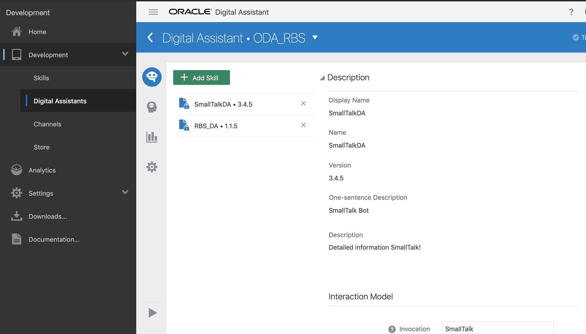

# Use With DA Routing

Copyright (c) 2020, Oracle and/or its affiliates.

[Back](../README.md)

## How to use with Oracle Digital Assitant Routing

To use the bot with the Oracle Digital Assistant Routing feature, publish the bot and then add it as additional skill within your Digital Assistant resource:

- import the bot skill, as already shown in the main installation guide
- train the skill, we prefer to use the `Trainer Tm`, which is the machine learning based model
- publish the bot
- create new DA under `Development`->`Digital Assistants`
- select the skills in DA and include also the Smalltalk Bot
- test

For more information, check the official documentation: [ODA Documentation](https://docs.oracle.com/en/cloud/paas/digital-assistant/use-chatbot/digital-assistants-ada.html)

### Example

